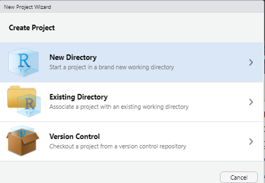

class: inverse, top, center
background-image: url(Files/cover.png)
background-size: cover

```{r setup, include=FALSE}
options(htmltools.dir.version = FALSE)
knitr::opts_chunk$set(fig.retina = 3, warning = FALSE, message = FALSE)
```


```{r metathis, echo=FALSE}
library(metathis)
meta() %>%
  meta_name("github-repo" = "r4hr/r4hr_paworld_intro_dplyr") %>% 
  meta_social(
    title = "How to Clean your Data Quickly With Tidyverse",
    description = paste(
      "This is an introductory tutorial about cleansing data",
      "for the People Analytics World conference 2021",
      " developed by Sergio Garcia Mora"),
    url = "https://how-to-clean-data-quickly.netlify.app/#1",
    image = "https://github.com/r4hr/r4hr_paworld_intro_dplyr/blob/main/Files/cover.png",
    image_alt = paste(
      "A quick introduction to cleaning data in R", 
      "Developed by Sergio Garcia Mora"
    ),
    og_type = "website",
    og_author = "Sergio Garcia Mora",
    twitter_card_type = "summary_large_image",
    twitter_creator = "@sergiogarciamor",
    twitter_site = "@data4hr"
  )
```
---
class: top, center
background-image: url(Files/dataiq1.png)
background-size: contain


---
class:  top, center
background-image: url(Files/dataiq2.png)
background-size: contain

---

class: top, center
background-image: url(Files/dataiq3.png)
background-size: cover

---
class: inverse, top, center
background-image: url(Files/team.png)
background-size: cover

---
# Club de R para RRHH
.left-column[
.middle[

]
]

.right-column[
The [Club de R para RRHH](https://linktr.ee/r4hrclub) is a community for learning to code in R for people who work in Human Resources or aspire to work in this field.

We develop resources in Spanish, use HR data in our examples, and we learn how to use different packages, learn how to make predictive analysis, text mining and so on.

This is a project that has gathered people from Perú, Chile, Paraguay, Colombia, Spain, Uruguay, Panamá, Argentina and many more `r emo::ji("globe")`.
]

---
class: inverse, middle, center
## Let's get to work!


---
# The R language
## Projects

Working with projects in RStudio makes everything simpler. RStudio Projects create a local folder in your computer in which every file, script, and resources will be saved there, in a more organized way.

--

To create a project go to:
* *File*
  * *New project*

And then write the name of the new folder.

.pull-left[]


.pull-rigt[]

---
# What's a R package?

R is a open source language, that became very popular for analyzing data and statistical analysis. Nowadays it has a wide range of aplications and uses beyond statistics.

--

*Packages* are a sort of 'extensions' that expand R base capabilities and allows us to make specific things in a easy way. Pablo Tiscornia made a great analogy to explain the difference what packages are.

--

.pull-left[

]

--
.pull-right[

]

---
# Tidy data

.left-column[

]

.right-column[
Data in tutorials is perfect, neat, and clean. And everytime you try to replicate the same analyisis with your own data, things rarely work in the same way, and you end up spending a lot of time getting your data right to run an analysis... in Excel `r emo::ji("doubt")`
]
--
.right-column[
That's why cleaning and tidying your data explains from 60 al 80% of the time of any Analytics project. This process is known as *data cleansing* or *data wrangling*. **Tidyverse** is collection of packages that allow us to get our **tidy data** to develop our analysis. There are some **tidy data principles** we all need to know:
]
--
.right-column[
1. Each variable must have its own column.
2. Each observation must have its own row.
3. Each value must have its own cell.
]

---
background-color: #BDCBD4
# Tidyverse

Tidyverse is a collection of packaged for cleaning, transforming, manipulating and wrangling data. 

.center[]

To start using we have to install it. This is a one time process, and all you have to do is type in your RStudio console
```{r install, echo=TRUE, eval=FALSE}

# Install tidyverse packages for the first time
install.packages("tidyverse")

```

---
# Tidyverse

Once the package is installed, we need to load or "activate" the package in order to use its functions. We need the `library()` function to do it.

```{r echo = TRUE, message=TRUE, warning=TRUE}
# Load tiverse packages
library(tidyverse)
```

---
## dplyr

.left-column[

]

.right-column[
**dplyr** is the main package of the *tidyverse* collection for *data wrangling*.

One of the reasons it became so popular is that its functions emulates our colloquial way to approach a problem.

Another important factor is that the function names are straight forward to comprehend what they do, and the logic and parameters in most of them are very similar.

That means when you understand the basics of one function you get an idea of how they all work.
]

---
## dplyr, an example

Let's take a look into a dplyr's sequence:

Let's say you have a salary survey and you want to know the mean salary for HR positions. Can you follow every step of this script?:

--

```{r eval=FALSE}
hr_data %>%                               # Call the dataframe
  select(position, salary) %>%            # Picks columns to analyse
  filter(salary < 500000) %>%             # Filter salaries below $ 500.000
  group_by(position) %>%                  # Groups the results by position
  summarise(mean_salary = mean(salary))   # Calculate mean salary for position
```


---
## The 'pipe' operator

.left-column[

]

.right-column[
Did you see this symbol `%>%` in the previous slide? This symbol is known as the **'pipe'** and allows you to write functions as a sequence, making it easier to read and understand the script. This is particularly useful when you're concatenating several steps of functions in your analysis.
]
.right-column[
Let's imagine you want to get a list of HRBP's salaries per industry, organized from highest salary, to the lowest. 
]

--
.right-column[**Steps:**

1. Load data, and select `role`, `base_salary` and `industry`variables.
2. Filter by `role == "HRBP"`
3. Arrange results descendently by `base_salary`.
]
---
## The 'pipe' operator

This is how the codes looks like

```{r, echo= TRUE, eval=FALSE}
# Code WITHOUT the pipe operator
arrange(filter(select(salaries, role, base_salary, industry), role == "HRBP"), desc(base_salary))
```

--

```{r, echo= TRUE, eval=FALSE}
# Code WITH the pipe operator
salaries %>% 
  select(role, base_salary, industry) %>% 
  filter(role == "HRBP") %>% 
  arrange(desc(base_salary))
```

---
 class: inverse, middle, center
# The Analysis Process

1. Set an analysis goal.
2. Gather and explore the data.
3. The [Ben Teusch](https://www.linkedin.com/in/teuschb/) `r emo::ji("rockstar")` approach: Identify the groups to compare, calculate summary statistics, plot results.

---
# The Analysis Process

.left-column[
## Set an analysis goal
]

.right-column[
With the available data we can:

* Make salary analysis per role.
* Make salary analysis per industry.
* Analyze relationships between salary and satisfaction.
* Analyze relationships salary and intention to leave.
]

--
.right-column[
We also can analyze gender pay gaps. `r emo::ji("king")``r emo::ji("money")``r emo::ji("queen")`

]
---
class: inverse, middle, center
# Let's get to know our data

---
# `r emo::ji("kiwi")` KIWI: Key Investigation of Wages & Income
## aka HR Salary Survey from Argentina

Last year, with the *Club de R para RRHH* we conducted a salary survey across Latin America to know salaries and some other things that we were interested on.

Another reason why we did this survey is because the lack of datasets in Spanish to practice.

In this workshop we'll use a sample of this dataset using data from Argentina. You can see and download the R script a full version of the analysis [in this link](https://rpubs.com/Data4HR/encuesta-kiwi-2020).

---
# The KIWI data

First, we need to load the `tidyverse` package and use a function from the `readr` package to load the data.

```{r data-load}
library(tidyverse)

# The url link to the location of the dataset
url_link <- "https://raw.githubusercontent.com/r4hr/r4hr_paworld_intro_dplyr/main/salary_survey_ar.csv"

# Load the csv file from GitHub
salaries <- read_delim(url_link,    #<<
                       delim = ";") #<<

```

---
## A `glimpse` into the KIWI data

```{r glimpse}
# Let's explore the structure of the dataset
glimpse(salaries)
```

```{r echo=FALSE}
options(scipen = 999)
```

---
## Let's explore the data

.pull-left[
One of the main things we want to explore are salaries, so, first, we have to know its distribution. Let's plot a histogram.

```{r hist1, out.width="70%"}
ggplot(salaries, 
       aes(x = base_salary)) +
  geom_histogram()
```

]

--
.pull-right[
What happened here? `r emo::ji("confused")`

Let's take a look into the variable.

```{r summary1}
summary(salaries$base_salary)
```

]

--
.pull-right[
There are some valid cases with unusual high cases (over `AR$ 2M`), and there are spurious cases with `AR$ 2`. `r emo::ji("surprised")`
]
--

.pull-right[
So, let's meet our first `dplyr` function: `filter()`.
]

---
# filter()

The `filter()` function allows us to pass the observations (rows) that matches a criteria. We'll need some logical operators for this.

.center[
```{r logical-operators, echo = FALSE}
library(gt)
gt(
  data.frame(
    "Symbol" = c("<", "<=", ">", ">=", "==", "!=", "&", "|"),
    "Meaning" = c("less than", "less or equal to", "higher than", "higer or equal to",
                "equal to", "not equal to", "and", "or")
  )
) %>% 
  cols_align(
    align = "center",
    columns = everything()
  )
```
]

---
# filter()
## Examples

Let's see the data of the *CHRO* `role`:

```{r filter1}
salaries %>% 
  filter(role == "CHRO") #<<
```

---
# filter()
## Examples

All the data **but** CHRO.

```{r filter2}
salaries %>% 
  filter(role != "CHRO") %>% #<<
  head() # Erase the last pipe and this line
```

---
# filter()
## Examples


Filter by two conditions:
```{r filter3}
salaries %>% 
  filter(industry == "Construction" & gender == "Female") #<<
```

---
# filter()
## Examples

.pull-left[
`r emo::ji("question")` What if you want to filter data by **two** industries?

```{r filter4}
salaries %>% 
  filter(industry == "Media" & industry == "Chemical Industry") %>%  #<<
select(role, base_salary) 
```
]

--

.pull-right[
This would do the job `r emo::ji("+1")`
```{r filter5}
salaries %>% 
  filter(industry == "Media" | industry == "Chemical Industry") %>%  #<<
select(role, base_salary) %>% head()
```

]

---
# filter()
## Examples

A best-practice way to filter by more than one condition is using a selection vector:

```{r filter6}
salaries %>% 
  filter(industry %in% c("Media", "Health", "Technology")) %>% #<<
  select(role, base_salary)
```


---
# filter()
## Let's go!

Let's create a new dataframe with clean data with the helping function `between`:
```{r filter-final}
clean_salaries <- salaries %>% 
  filter(between(base_salary, # Variable to filter #<< 
                 20000,       # Low filter #<<
                 500000),     # Top filter #<<
         hr_experience_years < 30) #<<
```

--
.right[
```{r hist2, echo=FALSE, out.width="30%"}
ggplot(clean_salaries, aes(x = base_salary))+
  geom_histogram()
```
]

---
# select()

.pull-left[
The `select()` function allows you to choose the variables you want to analyze. We can also drop variables we want to exclude.

```{r select1}
clean_salaries <- clean_salaries %>% 
  select(-age) # Exclude age variable
```

]

.pull-right[

]

---
# Let's make sense of our data

.left-column[

]

.right-column[
Salaries are in Argentinean pesos... so it's hard to tell if a `base_salary` is high or low because we don't know the currency, so we need to transform the `base_salary` into a currency we know.
]

--
.right-column[
Enter the `mutate()` function.

]

---
# mutate()

One use of `mutate()` is to create a new variable from existing variables. Something important to know is that the new variable is not added to the original data source... unless we tell R to do it so.

--
So, in order to calculate the `base_salary` you'll need this table:

```{r exchange, echo = FALSE}
gt(
  data.frame(
    "Currency" = c("Euro", "Dollar", "Pound Sterling", "Swiss Franc", "Yen", "Real", "Canadian Dollar" ),
    "Divide by" = c(112, 93, 127, 102, .86, 17, 74)
  )
)
```


---
# mutate()

Now we can create a new column, call `int_salary` based on the exchange rate. To achieve this we have to create a new column, based on the `base_salary` original variable, divided by the exchange rate.

```{r mutate1}
clean_salaries <- clean_salaries %>%     # Overwrite the same dataframe
  mutate(int_salary = base_salary / 112) # Estimate salary in Euro #<<

glimpse(clean_salaries)
```

---
---
class: inverse
# Practice

.pull-left[

]

.pull-right[
1. Load data
2. Filter salaries between AR$ 20.000 and 500.000
3. Create a new column with a new currency using the proper exchange rate.
]
---
# mutate()
## Other uses

.pull-left[
Let's make a plot of the mean salary by role.

```{r mutate2, fig.show='hide'}
clean_salaries %>% 
  group_by(role) %>% 
  summarise(mean_salary = mean(int_salary)) %>% 
  ggplot(aes(x = mean_salary, y = role)) +
  geom_col()
```

]

.pull-right[
```{r ref.label="mutate2", echo = FALSE}

```

]


---
# mutate()
## Other uses

The `role` variable is plotted alphabetically ordered, which in this case is not appropiate because it doesn't respect the hierarchy of the different positions.

We can use `mutate()` to overwrite the variable and change its properties. So, let's transform the variable into a `factor` type, so we can define the levels of the variable.

```{r mutate3}
clean_salaries <- clean_salaries %>% 
  mutate(role = factor(role,         # Overwrite the same variable #<<
                       # Define the order of the variable
                       levels = c("Administrative", "Analyst", "Supervisor",       #<<
                                  "HRBP", "Head", "Manager", "CHRO"))) #<<
```

---
# mutate()
## Other uses

.pull-left[
Let's repeat our last plot:

```{r mutate4, fig.show='hide'}
clean_salaries %>% 
  group_by(role) %>% 
  summarise(mean_salary = mean(int_salary)) %>% 
  ggplot(aes(x = mean_salary, y = role)) +
  geom_col()
```

]

.pull-right[
```{r ref.label="mutate4", echo = FALSE}

```

]